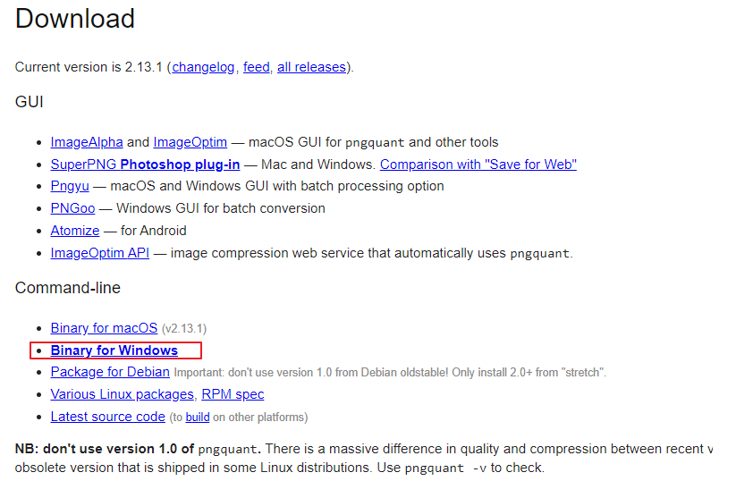
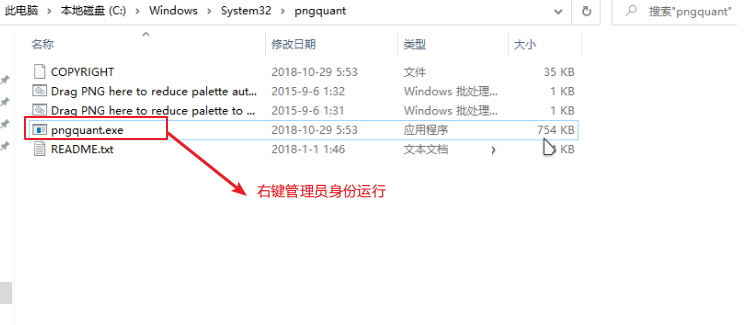

## 本机运行环境介绍
```shell
node -v
v16.18.0


npm -v
8.19.2
```
>ps:我切了一下node的14.12.0版本，貌似也可以，但是不管哪个版本都要解决下面这个问题
> 
> 该问题在我电脑出现，不一定必现，若可以正常运行请忽略

## 打包运行build提示png图片处理异常的解决方法
https://blog.csdn.net/weixin_42050406/article/details/121998732

-> 前往 https://pngquant.org/ 下载pngquant库

->解压压缩包至C:\Windows\System32目录下

->管理员身份运行pngquant.exe

再安装就不会报错了

PS:以管理员运行pngquant.exe的时候，可能会遇到缺少vcruntime140.dll库的提示


